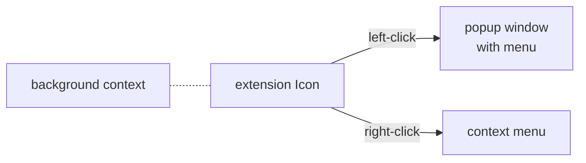

Shortcuts for Chrome is essentially constructed as follows.

All user interaction happens through the visible extension icon.
Clicking on the icon renders the relevant extension menus.
Modules running in the background context are "headless," meaning there is no human-visible interface.
Different extension modules communicate by message passing and over shared memory.

The diagram visualization follows closely to the source code organization, in the **`src`** directory.

* **`popup`** manages the popup window that is visible at the browser front-end.
It saves and restores user preferences and loads the navigation menu inside the popup window.

* **`menu`** displays a list of Chrome shortcuts.
It programmatically handles link click actions and logs recently used links.

* **`background`** modules manage the extension context menu, that has some additional useful links.

Technical details of the modules are in [source code documentation](api.md).

